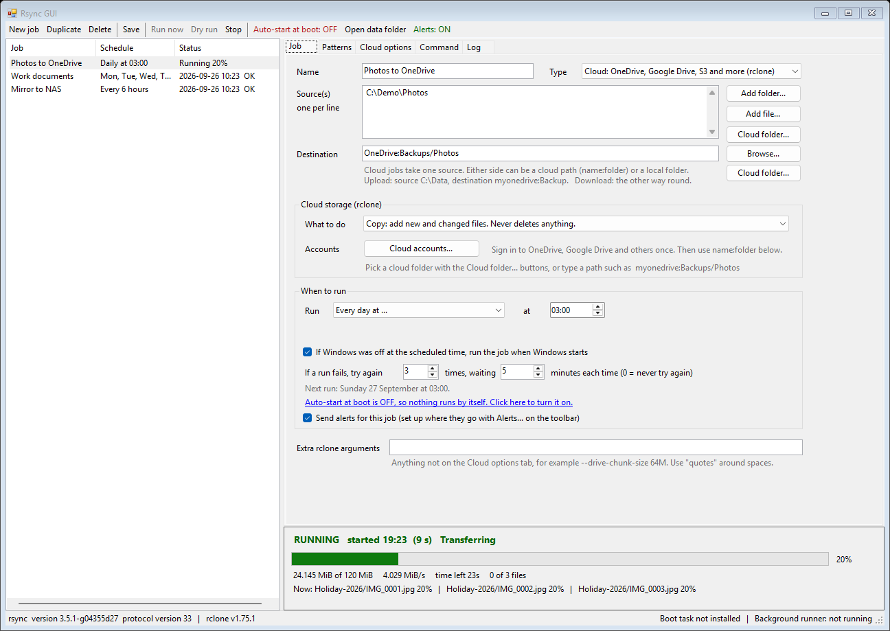
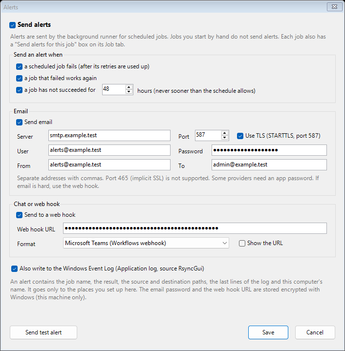
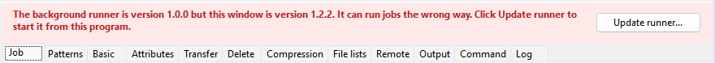

# Rsync GUI

A Windows program that backs up and syncs your files from a normal window. No command line.

It runs the real **rsync** for folders, network shares, SSH servers and rsync servers. It runs the real **rclone** for OneDrive, Google Drive, Dropbox and about 70 other cloud services.
You set a schedule, watch live progress, and it keeps working after every reboot.



## Contents

- [What you get](#what-you-get)
- [Download and install](#download-and-install)
- [Quick start](#quick-start)
- [Recipes](#recipes)
- [Job types in detail](#job-types-in-detail)
- [Schedules](#schedules)
- [Auto-start after a reboot](#auto-start-after-a-reboot)
- [Live progress](#live-progress)
- [Failure alerts](#failure-alerts)
- [Logs](#logs)
- [Where your data lives and who can read it](#where-your-data-lives-and-who-can-read-it)
- [Command line switches](#command-line-switches)
- [How it works inside](#how-it-works-inside)
- [Upgrading](#upgrading)
- [Troubleshooting](#troubleshooting)
- [Limits](#limits)
- [Build from source](#build-from-source)
- [Licences and credits](#licences-and-credits)

## What you get

| | |
|---|---|
| **Three job types** | Files (rsync), Cloud (rclone) and Server (`rsync --daemon`). |
| **Every rsync option** | About 140 rsync options with their own tabs and tick boxes, plus an Extra arguments box for anything else. |
| **Cloud accounts inside the window** | Add, sign in to, test and remove OneDrive, Google Drive, Dropbox, Box, S3, Azure, Backblaze, SFTP, WebDAV and more. Browse cloud folders and pick one. |
| **Copy, sync, move and two-way** | Four cloud modes, each explained in plain words on the screen. |
| **A real scheduler** | At Windows start, every N minutes or hours, every day at a time, or on chosen days. Missed runs are made up. Failed runs retry a set number of times. |
| **Survives reboots** | A Windows scheduled task starts a hidden runner before anyone signs in. Interrupted jobs continue where the files stand. |
| **Live progress** | A bar, percentage, speed, time left, file count and the files being worked on right now, for every running job. |
| **Failure alerts** | Email, Slack, Microsoft Teams, Discord or your own web hook, plus the Windows Event Log, when a scheduled job fails, works again, or has not succeeded for too long. |
| **Short logs** | Progress noise stays out of the log. Errors are counted and capped. No log grows past 20 MB. |
| **The exact command** | The Command tab shows the full command line before you run it. Dry run tests without changing anything. |
| **One folder, no installer** | Unzip and run. The zip holds the GUI, rsync, rclone and ssh. |

## Download and install

1. Open the [Releases page](https://github.com/tlaskar-git/rSync-GUI/releases) and download the latest `RsyncGui-x.y.z.zip`.
2. Unzip it. A good place is `C:\Program Files\RsyncGui`. Any folder works, but keep it there, because the boot task points at it.
3. Start `RsyncGui.exe`. Windows asks for administrator rights. Say yes.

**Requirements**

- Windows 10, Windows 11 or Windows Server 2016 or later, 64-bit. It was built and tested on Windows Server 2025. Windows 10 and 11 are not tested yet.
- .NET Framework 4.x. Every supported Windows version already has it.
- Administrator rights, because the program can create a scheduled task and protects its data folder.
- About 100 MB of disk space for the program and its bundled tools.
- The program is not code signed, so Windows SmartScreen or antivirus can warn on the first start.

The GUI itself makes no network connections. Network traffic comes only from rsync, ssh or rclone, and only to the places you set up.

## Quick start

1. Click **New job** and give it a name.
2. Pick the **Type**:
   - **Files** to copy folders locally, to a network share, over SSH or to an rsync server.
   - **Cloud** to copy to or from OneDrive, Google Drive and the others.
   - **Run an rsync server** to serve folders to other machines.
3. Fill in the **Source** and the **Destination**.
4. Open the **Command** tab and read the command. Click **Dry run** to see what would happen without changing anything.
5. Click **Run now**. The panel at the bottom shows progress.
6. Choose **When to run** on the Job tab, then click **Save**.
7. For schedules that run by themselves, click **Auto-start at boot** on the toolbar once.

## Recipes

### Back up a folder to OneDrive every night

1. **New job**, Type **Cloud**.
2. Click **Cloud accounts...**, then **Add account...**. Name it `OneDrive`, pick **Microsoft OneDrive**, click **Sign in / Create** and finish the sign-in in the browser window that opens.
3. Back on the Job tab, source `D:\Documents`, destination `OneDrive:Backups/Documents` (or click **Cloud folder...** and browse).
4. **What to do**: Copy. This adds new and changed files and never deletes anything.
5. **When to run**: Every day at 02:00. Leave the missed-run box ticked.
6. **Save**, then switch **Auto-start at boot** on.

### Mirror a folder to a NAS or server over SSH

1. **New job**, Type **Files**.
2. Source `D:\Data\` (with the trailing backslash). Destination `backup@nas.example.test:/srv/backup/data`.
3. Set the **SSH key file**. Log in with a key, because there is no password prompt.
4. On the **Delete** tab tick `--delete` if the copy must match the source exactly. Run a **Dry run** first and read what it would delete.
5. Choose a schedule and save.

### Keep two folders the same in both directions

1. **New job**, Type **Cloud**, **What to do**: Two-way (bisync).
2. Put one path in Source and the other in Destination. Either can be a cloud path.
3. On the **Cloud options** tab tick `--resync` for the first run only. Untick it afterwards.

### Get told when a backup fails

1. Click **Alerts...** on the toolbar and tick **Send alerts**.
2. Pick where the alerts go: fill in **Email**, or paste a **web hook** URL from Slack, Microsoft Teams or Discord and pick its format. The Windows Event Log is on by default.
3. Click **Send test alert** and check that it arrives.
4. Click **Save**. Every scheduled job now sends alerts (each job has a **Send alerts for this job** box on its Job tab).

### Serve a folder to other machines

1. **New job**, Type **Run an rsync server**.
2. Edit the module on the **Daemon** tab. The template shares `D:\Backup` as `[backup]`.
3. On the Daemon tab click **Open Windows Firewall port...** so other machines can connect. The default port is 873 (change it with `--port` on the Remote tab).
4. Schedule the job **Once each time Windows starts**. A server job restarts 15 seconds after it stops.

## Job types in detail

### Files (rsync)

Rsync compares the source and destination and sends only what changed. This program runs the official rsync 3.5.1 and builds the command for you.

**How to write a path**

| Where | How to write it |
|---|---|
| Local folder | `C:\Data\` |
| Network share | `\\server\share\folder` |
| Over SSH | `user@host:/srv/data` |
| Rsync server | `rsync://host/module` or `host::module` |

- Use normal Windows paths in the window. The program converts them to the form rsync needs (`C:\Data` becomes `/cygdrive/c/Data`).
- A trailing `\` or `/` on a source copies the contents of the folder. Without it, rsync copies the folder itself into the destination.
- Several sources are allowed, one per line.
- Paths you type inside **Extra rsync arguments** are passed exactly as typed, so write them in the `/cygdrive/c/Folder` form there.

**Option tabs.** Every rsync option that takes a flag or one value is on a tab: Basic, Attributes, Transfer, Delete, Compression, File lists, Remote and Output. Hover a box to see the flag. The **Command** tab shows the result.

**Patterns tab.** Type include patterns, exclude patterns or advanced filter rules, one per line. Includes are checked first, then filters, then excludes. **Add common excludes** adds `node_modules/`, `*.tmp`, `Thumbs.db`, `~$*` and `.DS_Store`.

**SSH.**

- Key login only. There is no password prompt, and the connection never waits for one.
- Each run uses a private copy of your key file, because the bundled ssh refuses key files that look readable by others. The copy is deleted when the run ends. Your original key file is never changed.
- New host keys are accepted on first contact. Untick **Accept new host keys automatically** to refuse them. Known hosts are kept in the data folder.
- The **Daemon password** field is for `rsync://` servers. It is stored encrypted with the Windows Data Protection API (DPAPI, this machine only) and sent to rsync as the `RSYNC_PASSWORD` variable.

**Permissions.** Windows drives are mounted without POSIX ACL emulation, so copied files keep normal Windows permissions. The options `--perms`, `--owner` and `--group` do not map onto Windows ACLs.

### Cloud (rclone)

Rsync cannot talk to cloud services, so cloud jobs use rclone, the standard tool for that work. The window drives it for you.

**Add an account**

1. On the Job tab click **Cloud accounts...**, then **Add account...**.
2. Type an account name (letters, digits, `-` and `_`). Pick the storage type from the list of about 70.
3. Fill in the fields the dialog shows. Hover a field for its full help. Fields marked `*` are required.
4. Click **Sign in / Create**.
   - **OneDrive, Dropbox, Box and similar:** your browser opens. Sign in there. The window closes by itself when you finish.
   - **Google Drive:** you must create your own free Client ID and Secret first. Google is retiring the shared key that rclone ships with (during 2026). The dialog links the steps: https://rclone.org/drive/#making-your-own-client-id
   - **S3, SFTP, WebDAV, SMB, FTP and similar:** fill in the host, user and keys. Passwords are stored obscured by rclone.
5. Use **Test** in the accounts window to check the connection. **Remove** deletes an account (your cloud files are not touched). **Classic setup...** opens rclone's own text setup in a console for anything the dialog does not cover.

**Use an account.** Write cloud paths as `accountname:folder/subfolder`, for example `OneDrive:Backups/Photos`. Click **Cloud folder...** next to the source or destination to browse and pick a folder. One side of a cloud job is the cloud and the other side is a local folder. Upload means local source and cloud destination. Download is the other way round. A cloud job takes one source.

**Modes**

| Mode | What it does | Deletes files? |
|---|---|---|
| Copy | Adds new and changed files. | Never. |
| Sync | Makes the destination match the source. | Yes, extra files at the destination. |
| Move | Copies, then removes the files from the source. | Yes, from the source. |
| Two-way (bisync) | Keeps both sides the same. | Yes, on either side. |

Sync, Move and Two-way remove files. Run a **Dry run** first. For Two-way, tick `--resync` on the first run only.

**Cloud options tab.** About 55 rclone flags: transfers and checkers, bandwidth limit, age and size limits, delete timing, checksums, retries, timeouts, rename tracking, log level and the flags that only apply to two-way runs. Anything else goes in **Extra rclone arguments**.

**Symbolic links.** New cloud jobs tick `skip-links`, so folders such as `node_modules` do not fill the log with one notice per link.

**Where the accounts live.** In `rclone.conf` in the data folder (see [Where your data lives](#where-your-data-lives-and-who-can-read-it)). The window and the background runner use the same file, so a sign-in you make in the window works for scheduled runs.

### Server (rsync --daemon)

Runs `rsync --daemon --no-detach` with the `rsyncd.conf` text you edit on the **Daemon** tab. Set the listening port and address on the **Remote** tab (`--port`, `--address`). The Daemon tab has a button that adds the Windows Firewall rule for the port. Paths in `rsyncd.conf` use the `/cygdrive/d/Backup` form.

## Schedules

Every job has a **When to run** box on the Job tab.

| Choice | What it does |
|---|---|
| Only when I click Run now | No schedule. |
| Once each time Windows starts | Runs after every boot. |
| Repeat every ... | Every N minutes or hours. The timer counts from the end of the last run, so runs never overlap. |
| Every day at ... | Once a day at the time you pick. |
| On chosen days at ... | Tick the weekdays and pick the time. |

- **Missed runs.** If Windows was off at a daily or weekly time, the job runs when Windows starts. Untick the box to skip missed runs.
- **First run.** A repeating job that has never succeeded runs as soon as the runner starts. A daily or weekly job waits for its first slot. Click **Run now** to start it earlier.
- **Failed runs.** The job tries again the number of times you set, waiting the minutes you set. Then it waits for the next scheduled time. A job that is set up wrongly is not retried.
- **Next run.** The text under the box and the status panel show when the next run starts.
- **Same job, one run.** A job never runs twice at once, whether you start it by hand or the runner starts it.

Schedules need the background runner. Switch it on with **Auto-start at boot** on the toolbar. The Job tab tells you when it is off.

## Auto-start after a reboot

Click **Auto-start at boot: OFF** on the toolbar. The program creates a Windows scheduled task named `RsyncGui Runner`.

- It starts 30 seconds after Windows boots, before anyone signs in.
- It runs as **SYSTEM** by default. That account can read all local files. It has no access to network shares that need your login, and it cannot see mapped drive letters such as `Z:` (use the `\\server\share` form). Pick a specific account in the dialog if you need those. The dialog asks for that account's password once.
- It runs `RsyncGui.exe --runner`, a hidden program with no window.
- The runner runs every job that has a schedule. It re-reads the job list every 5 seconds, so changes you save apply without a restart.
- If the runner stops, Windows restarts it after a minute.
- After a reboot, rsync and rclone continue from what is already copied. Kept partial files (`--partial`) let big files resume.

Click the button again to remove the task.

## Live progress

The panel at the bottom follows the selected job.

- **RUNNING** shows when the job started and how long it has run, a progress bar, the percentage, how much is done, the speed, the time left, the file count and the files being worked on now.
- While rclone is still listing folders the bar slides back and forth and the panel shows how many items it has found.
- **IDLE** shows the result of the last run and the next run time.
- The job list shows `Running 23%` next to every running job.

It works for jobs you start in the window and jobs the background runner starts, because both write the same small progress file. Rsync reports progress for the whole run. Rclone reports the percentage of the bytes it knows about so far, so the number can move while it discovers more files.

## Failure alerts

Scheduled jobs run with nobody watching, so a failure can go unnoticed for days. Alerts tell you.



**When an alert is sent**

| Event | What you get |
|---|---|
| A scheduled job fails and its retries are used up | One alert with the job, the result, the source and destination, and the last lines of the log. |
| The job keeps failing | A reminder every 24 hours. Not one alert per attempt. |
| A job that failed works again | An "OK again" message, if you left **a job that failed works again** ticked. |
| A job has not succeeded for too long | A warning once a day. The default is 48 hours. The limit is never shorter than 1.5 times the schedule's own gap, so a weekly job is not reported after two days. |

Alerts are sent by the background runner, so they need **Auto-start at boot** to be on. Jobs you start by hand from the window do not send alerts, because you are looking at them. A job that is set up wrongly (a missing program, an unknown job type) counts as failed at once, because it is not retried.

**Where alerts go**

- **Email.** Server, port, user, password, from and to. Several recipients are allowed, separated by commas. Use TLS with port 587 (STARTTLS), which is what most providers offer. Port 465 with implicit SSL is not supported. Some providers need an app password instead of your normal one, and Microsoft 365 must have SMTP sign-in switched on for the account. If email is hard to set up, use a web hook.
- **Web hook.** Paste the URL and pick the format:
  - **Slack, or a Teams incoming webhook connector** sends `{"text": "..."}`.
  - **Microsoft Teams (Workflows webhook)** sends an Adaptive Card. In Teams, create a workflow from the template that posts to a channel when a web request is received, and copy its URL. Menu wording changes from time to time.
  - **Discord** sends `{"content": "..."}`. In Discord open the channel settings, Integrations, Webhooks, and copy the URL.
  - **Plain JSON** sends `app`, `event` (`failed`, `recovered`, `stale` or `test`), `job`, `host`, `subject`, `message` and `time`, for your own tool.
- **Windows Event Log.** Entries appear in the Application log with the source `RsyncGui`. Event 1001 is a failure (Error), 1002 is recovery (Information), 1003 is a stale job (Warning) and 1000 is a test. Other tools can collect these.

**Good to know**

- **Send test alert** tries every channel you filled in and tells you which worked. It ignores the master switch, so you can test before you switch alerts on.
- The email password and the web hook URL are stored encrypted with Windows (this machine only). The URL of a web hook works like a password, so keep it private.
- An alert contains the job name, the result, the source and destination paths, the last lines of the log and this computer's name. It goes only to the channels you set up.
- If a channel fails to send (for example the mail server is down), the runner writes the reason to `logs\_runner.log` and carries on. A failed alert never stops a job.
- Changing an alert setting applies straight away. It never interrupts a running job.

## Logs

- The **Log** tab shows the log of the selected job, live. **Open log file** opens it in Notepad.
- A log records the command, the useful output and one summary at the end. Progress lines are not written.
- Each run writes at most 100 error lines and 3 symbolic link notices. The rest are counted. The job list shows `Some files failed (137 errors)` instead of thousands of lines.
- A log file never grows past 20 MB. At the limit the rest of the run is not logged, but the start, the end and the result are always recorded.
- When a log is over 5 MB at the start of a run, the old one is kept as `.log.1` and a new one starts. Each job keeps at most about 40 MB.
- Exit codes are shown as words (for example `Partial transfer due to error`).

## Where your data lives and who can read it

Everything is in one folder: **`C:\ProgramData\RsyncGui`**. The toolbar button **Open data folder** opens it.

| File or folder | Holds |
|---|---|
| `jobs.json` | Your jobs. |
| `alerts.json` | Where alerts go. The email password and the web hook URL are stored encrypted. |
| `rclone.conf` | Cloud accounts and their sign-in tokens. |
| `logs\` | One log per job, plus `_runner.log`. |
| `state\` | Small files: last result, next run, live progress, `_runner.version` (which version the runner is) and `<job>.alert` (what has already been reported for a job). |
| `locks\` | Lock files that stop a job running twice, and Stop requests. |
| `known_hosts` | SSH host keys. |
| `home\` | Home folder for the bundled ssh. |

**Security notes**

- The runner runs the jobs in `jobs.json` as SYSTEM. So the data folder can be changed only by SYSTEM, Administrators and the account that created it. Ordinary users cannot edit it.
- `rclone.conf` holds tokens in the way rclone stores them. Treat that folder like a password store. Daemon passwords use DPAPI. SSH key copies exist only while a run is in progress.
- While you create an account, or turn on auto-start for a specific account, secrets you type are passed to `rclone.exe` or `schtasks.exe` as command-line arguments for a moment. Administrators on the same machine can see command lines while they run.
- Nothing is sent anywhere except by rsync, ssh or rclone to the servers and services you configure.

## Command line switches

`RsyncGui.exe` with no switches opens the window.

| Switch | What it does |
|---|---|
| `--run "Job name or id" [--dry]` | Runs one job now and exits with the tool's exit code. Useful from your own scripts or Task Scheduler. |
| `--runner` | The hidden background runner. The boot task uses this. |
| `--enable-autostart [USER PASSWORD]` | Creates the boot task. Without a user it runs as SYSTEM. |
| `--disable-autostart` | Removes the boot task. |
| `--shot FOLDER` | Saves a picture of every tab (used to make the screenshots). |

The environment variable `RSYNCGUI_DATA` moves the data folder, which is handy for trying things out.

## How it works inside

- **One program.** `RsyncGui.exe` is a single .NET Framework program written in C#. It has no installer and needs no SDK to build. It has three modes: the window, the runner and the command line.
- **Bundled tools.** `bin\rsync.exe` is the official rsync built from source under Cygwin. `bin\ssh.exe` and `bin\ssh-keygen.exe` come from Cygwin OpenSSH. `bin\rclone.exe` is the official rclone release. The DLLs next to them are the Cygwin runtime. Nothing in them is modified.
- **Jobs.** A job is a record in `jobs.json`. The program turns it into one command line. It converts Windows paths to Cygwin paths for rsync and passes them as they are to rclone.
- **Running.** The program starts the tool, reads its output line by line, writes the log, counts errors and updates the progress file. A lock file per job stops two runs at once. Stop writes a small file that the running job notices within a second.
- **Cygwin settings.** The `etc\fstab` file mounts Windows drives without ACL emulation, so copied files keep normal Windows permissions. SSH key copies are made under the program's own `tmp\keys` folder, where Cygwin enforces private permissions.
- **Alerts.** After a scheduled run has its final result, the worker asks `Alerts` whether to report it. A small file per job (`state\<job>.alert`) records what was already reported, so one failure streak gives one alert. Every few minutes the runner also checks for jobs that have not succeeded for too long. Messages go to each channel you enabled, and a channel that fails is logged and skipped.
- **Runner.** One worker thread per scheduled job. Each worker works out the next due time from the schedule and from the time of the last success (`state\<id>.ok`), sleeps until then, runs the job and repeats. The worker writes `state\<id>.next` so the window can show the next run.
- **Boot task.** A Windows scheduled task with a boot trigger and a 30 second delay. It ignores a second start, has no time limit and restarts on failure.
- **Cloud setup.** rclone can list its providers and their settings as data. The window builds the setup form from that list, then drives rclone's step-by-step setup protocol for the sign-in and the follow-up questions.

## Upgrading

The window and the background runner are the same program, so they must be the same version. An old runner does not understand newer job types and can run a job the wrong way.

**Version checks (from 1.2.2).** The runner records its version when it starts. If it differs from the window you have open, a red banner appears at the top of the window with an **Update runner...** button, and the status bar shows the runner's version. The button restarts the runner from the program you have open (it asks which account to run as, like the Auto-start button).
The job list also records which version saved it. A program refuses a job list saved by a newer version, instead of reading it and saving it back changed. A runner that meets a job type it does not know stops that job with a clear message in the log, and does not guess.


Versions before 1.2.2 do not have these checks, so the first upgrade from them uses the manual steps below.

1. Close the RsyncGui window.
2. Stop the runner. Open the old window and switch **Auto-start at boot** off, or run `RsyncGui.exe --disable-autostart` from the old folder.
3. Replace the program folder with the new one. Your jobs and accounts are in the data folder, so they stay.
4. Open the new `RsyncGui.exe` and switch **Auto-start at boot** on again.

Jobs made by older versions are converted when the new version opens them. For example "repeat every 1,440 minutes" becomes "Every 24 hours". Do not save jobs with an older window after you have used a newer one. The old window can change the job type back.

## Troubleshooting

**`Could not resolve hostname onedrive` in an rsync log.** The job Type is Files, but the destination is a cloud account. Set the Type to Cloud. Version 1.2 warns you and stops retrying when it sees this.

**A cloud job reports `Some files failed` with `The system cannot find the path specified` or `directory not found`.** A folder changed or disappeared while the run was in progress. The next run picks the files up. Exclude folders that change constantly, or run when they are quiet.

**`Can't follow symlink without -L/--copy-links` notices.** rclone skips symbolic links. Tick `skip-links` on the Cloud options tab to hide the notice, or `copy-links` to copy what the links point to.

**`corrupted on transfer: quickxor hashes differ`.** The file changed while it was uploading. Exclude it, or run again when it is quiet.

**A red banner says `The background runner is version X but this window is version Y`.** The runner that starts at boot is a different program from the window you opened, often an older copy in another folder. Click **Update runner...** in the banner, or follow the [upgrade steps](#upgrading).

**A log says `Unknown job type`.** The job was made by a newer version than the program that ran it. Update the program that runs the job (see the red banner above).

**No alert arrives.** Check that the toolbar says **Alerts: ON**, that the job has **Send alerts for this job** ticked, that **Auto-start at boot** is on (the runner sends the alerts), and that a channel is filled in. Click **Send test alert** to see which channel fails. A scheduled job only alerts after its retries are used up, so wait for them. Then read `logs\_runner.log` for a line starting `alert email failed` or `alert web hook failed`.

**The test email fails.** The message names the reason. Common ones are a wrong port, TLS switched off where the server needs it, a password that must be an app password, or a provider that blocks sign-in from programs.

**A job never starts by itself.** Check that the toolbar says **Auto-start at boot: ON**, that the job has a schedule other than "Only when I click Run now", and that the status bar says the runner is running. The panel at the bottom says why a job is not scheduled.

**A scheduled job cannot see a network share or drive letter.** The runner runs as SYSTEM. Use the `\\server\share` form, or turn auto-start on for a specific account.

**An SSH job says `Permission denied`.** Only key login works. Check the key file path on the Job tab and that the server accepts the key.

**Google Drive sign-in fails or is refused.** Create your own Client ID and Secret and put them in the account dialog (see the Cloud section).

**Windows blocks the program.** It is not code signed. Choose **More info**, then **Run anyway**, or unblock the downloaded zip in its file properties before unzipping.

## Limits

- Windows only, 64-bit.
- SSH uses key login. There is no password prompt.
- The runner does not read a mapped drive letter when it runs as SYSTEM.
- Files that change during a run can fail to copy or fail their checksum. There is no snapshot support (Volume Shadow Copy).
- Alerts use email (STARTTLS only), web hooks and the Windows Event Log. There is no SMS, and no alert for a job you start by hand.
- No automatic update. Follow the [upgrade steps](#upgrading).
- Tested on Windows Server 2025. A real reboot, a Google Drive sign-in and SSH to a remote host have not been part of the automated tests, but the scheduled task, the runner, local and daemon transfers, SSH against a local test server, and OneDrive uploads have been used.

## Build from source

You need Windows PowerShell and an internet connection. You do not need Visual Studio or the .NET SDK, because the program compiles with the compiler that ships in Windows.

```powershell
.\build\build-rsync.ps1     # Cygwin + official rsync source -> build\work\bundle (about 10 minutes, asks for elevation once)
.\build\build-rclone.ps1    # official rclone release, SHA-256 checked, added to the same bundle
.\build\build-gui.ps1       # compiles src\*.cs -> dist\RsyncGui
```

- `-Tag v3.x.y` on `build-rsync.ps1` and `-Version v1.x.y` on `build-rclone.ps1` pick other releases.
- Run `build-rclone.ps1` again after every `build-rsync.ps1`, because that script recreates the bundle.
- `build-gui.ps1 -NoManifest` builds a copy that runs without administrator rights, for testing.
- rsync is configured with `--disable-md2man --disable-openssl --disable-locale --disable-idn`. It keeps ACL, xattr, xxhash, zstd, lz4 and iconv support.

Source files in `src\`:

| File | Purpose |
|---|---|
| `Program.cs` | Entry point and command line switches. |
| `MainForm.cs` | The window. |
| `Model.cs` | Jobs, paths, the data folder, stored secrets. |
| `Options.cs`, `CloudOptions.cs` | The rsync and rclone option tables that build the tabs and the command. |
| `Runner.cs` | Command building, running a job, the log, the boot task, the background runner. |
| `Sched.cs` | Schedule rules. |
| `Progress.cs` | Live progress parsing. |
| `Cloud.cs` | rclone accounts, the setup dialogs and the cloud folder browser. |
| `Alerts.cs`, `AlertsUi.cs` | When to alert, sending by email, web hook and Event Log, and the Alerts window. |

## Licences and credits

- The GUI source and build scripts in this repository are free to use, copy, change and share under the **MIT licence**. See `LICENSE`.
  The programs bundled in the release zip keep their own licences, listed below.
- **rsync** is licensed under the GNU General Public Licence version 3. Source: https://github.com/RsyncProject/rsync (the release zip records the exact tag and commit in `licenses\SOURCES.txt`).
- **rclone** is licensed under the MIT licence. Source: https://github.com/rclone/rclone
- **Cygwin** and **OpenSSH** have their own licences. See https://cygwin.com/ and https://www.openssh.com/.
- The release zip contains `licenses\rsync-COPYING.txt`, `licenses\rclone-LICENSE.txt` and `licenses\SOURCES.txt`.

The rsync, rclone and ssh programs in the zip are unmodified builds of those projects. This project is a front end and is not affiliated with them.
